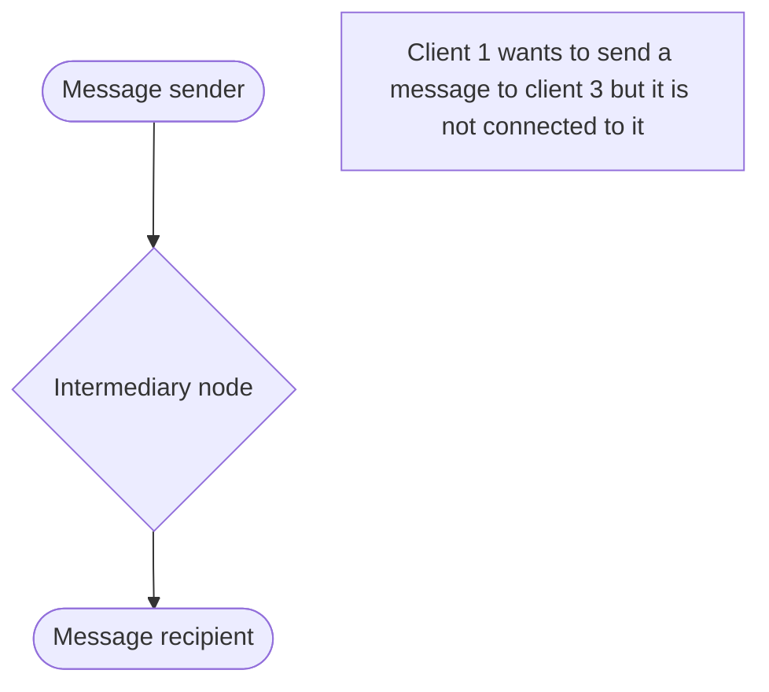
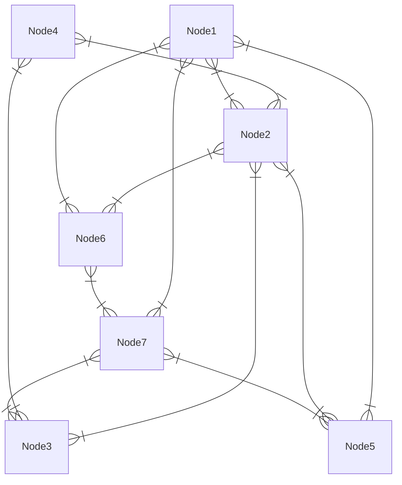
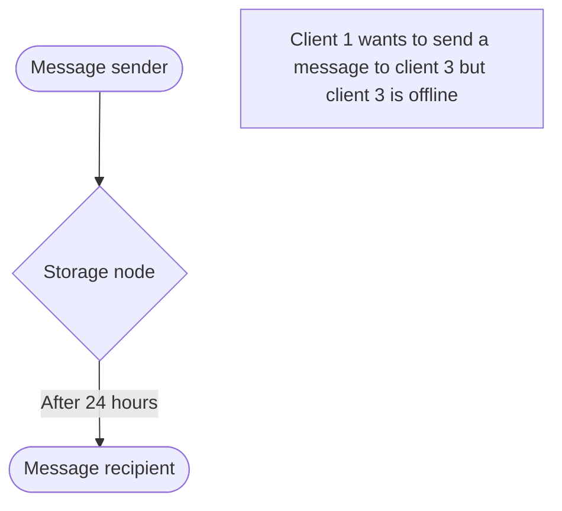
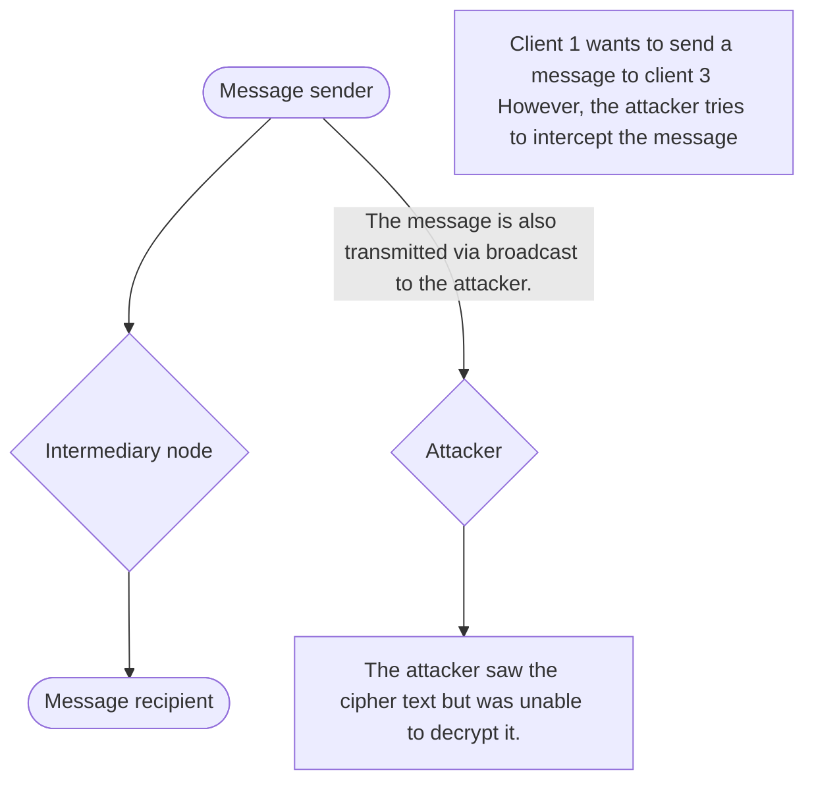

# Basics
## What is Secral?
Secral is a decentralized network of peer-to-peer nodes that allows users to send encrypted messages between different users, free of charge and without censorship. Messages function like emails, containing a subject line, a single recipient, and the body text. Unlike standard email protocols (Such as SMTP), no one other than the recipient can see the message.

## How Secral works?
Secral operates on a peer-to-peer basis, meaning each user is both a client and a server. This allows for massive network coverage without any server or single point of failure.

This is how messaging works in Secral:

Secral networks can look like this:

If the recipient is not online at the moment, the intermediary stores the message and sends it later.

## Naming system
Each node is assigned a unique ID that is readable and works similarly to an internet domain.
**NIS** Node Identification System works similarly to DNS. Each node has a NIS map, and each record contains an IP address, port, and public key used for encryption. If the sender doesn't know the recipient's NIS record, it will send a request to other nodes to provide it with the recipient's NIS record.
NIS domains are composed of the four-letter word "node" and part of the node's public key. A valid NIS domain should look like this: `node-xxxxxxxxxxxx`
The recipient's address consists of the local username and the node's domain. For example, `Default@node-xxxxxxxxxx`
Each node is required to have a system username called "Core" for sending ACK messages and NIS requests. Core addresses look like this: `Core@node-xxxxxxxxxx`

## Communication security
Each email message is encrypted with the **AES-256** algorithm and the key is **RSA** encrypted. This approach prevents an attacker from decrypting either the key or the message.

Another attack method could be DDOS to overload the network.
Secral protects itself against such attacks through a reputation system; nodes that send messages with errors, unsigned messages or random packets are disconnected from the network. Nodes can improve their reputation by transmitting messages correctly and sending ACK messages (acknowledgement of message receipt), etc.

## Why Choose **Secral**?

Traditional email protocols like **POP3, IMAP, and SMTP** were never designed with strong security in mind.  
While they rely on basic SSL/TLS transport encryption, they still expose sensitive data to mail servers and  
lack modern features such as end-to-end security or decentralized communication.

**Secral** solves these issues by providing:

- 🔐 **True End-to-End Encryption**  
  Your messages are encrypted with **AES-256** and secured with **RSA key exchange**,  
  ensuring that only sender and recipient can read the content.

- 🌍 **Decentralized by Design**  
  Unlike SMTP/IMAP, Secral does not depend on a central mail server.  
  This removes single points of failure and gives users full ownership of their communication.

- 🛡️ **Stronger Security Guarantees**  
  With modern cryptographic standards, Secral offers higher protection  
  against interception, tampering, and unauthorized access.

- ⚡ **Modern & Future-Proof**  
  While POP3 and IMAP are legacy protocols from the 1980s–90s,  
  Secral is built for today’s security requirements and tomorrow’s challenges.

- 🧩 **User Privacy First**  
  No third party — not even mail providers — can read your data.  
  Privacy is no longer optional, it’s the default.

| Protocol|Encryption standard|Decentralized|End-to-End Encryption|Compatibility|Use cases|
|--|--|--|--|--|--|
| Pop3|SSL/TSL|❌|❌|SMTP|Legacy systems|
| SMTP|SSL/TSL|❌|❌|POP3 ,IMAP|Universal sending|
| **Secral**|AES-256/RSA|✅|✅|❌|Synchronization|
| IMAP|SLL/TSL|❌|❌|SMTP| **Privacy-first communication**|

## License
Secral is licensed under the **MIT license**. This allows developers to create their own Secral clients and contribute to a better email sending experience.

# How to use Secral.Net
### Secral.net is still work in progress. 🏗️
